# Project Wafa — Architecture Design Document

**Falcon Bank UAE · Customer Retention Intelligence Platform**
Listen → Understand → Act

---

## 1. Project overview & business scenario

Falcon Bank UAE (fictional) runs a small (18-person) customer-experience team.
During a period of mass expatriate relocation, thousands of **multilingual**
messages (English, Arabic, Hindi/romanised Hindi, Tagalog) arrive faster than the
team can triage them. Project Wafa ("وفاء" — loyalty/faithfulness) turns that flood
into structured, prioritised, *human-reviewed* retention actions.

The platform has three capabilities:

1. **LISTEN** — turn raw text into structured signals (language, issue type, churn
   signal, entities).
2. **UNDERSTAND** — fuse text signals with banking behaviour into a churn-risk
   view, at both the individual and segment level.
3. **ACT** — choose a *transparent* retention action and draft a *human-reviewed*
   outreach message. Nothing is ever auto-sent.

## 2. Flow diagram

```mermaid
flowchart LR
    A[Raw Message + Customer ID] --> B[Data Loader]
    B --> C[NLP Pipeline: translate + classify]
    C --> D[Entity Extraction]
    D --> E[Customer Churn Model]
    E --> F[Fusion Layer]
    F --> G[Decision Engine]
    G --> H[Outreach Generator]
    H --> I[Guardrails]
    I --> J[Human Review Dashboard]
    J --> K[Audit Log]
```



## 3. Module boundaries & owners

> **Owners are generic `Student N` placeholders — replace with real team member names before submission.**

| Module | File | Responsibility | Owner |
|---|---|---|---|
| Config & contracts | `src/config.py`, `src/contracts.py` | Paths, label spaces, frozen interfaces | Student 1 |
| Data loader | `src/data_loader.py` | Clean DataFrames / dict rows | Student 1 |
| NLP pipeline | `src/nlp_pipeline.py`, `src/translation.py` | Language detect → translate → classify | Student 2 |
| Entity extraction | `src/entity_extraction.py` | spaCy + regex + multilingual keywords | Student 2 |
| Churn model | `src/churn_model.py`, `src/train_churn_model.py` | Tabular propensity + fairness audit | Student 3 |
| Fusion | `src/fusion.py` | Combine text + behaviour into one risk view | Student 3 |
| Decision engine | `src/decision_engine.py` | Transparent if/elif retention policy | Student 4 |
| Outreach + guardrails | `src/outreach_generator.py`, `src/guardrails.py` | LLM/template draft + safety checks | Student 4 |
| Audit + portfolio | `src/audit_logger.py`, `src/portfolio_summary.py` | Accountability log + segment view | Student 5 |
| Dashboard | `app.py` | Thin Streamlit presentation layer | Student 5 |
| Zero-shot bake-off + evaluation | `src/zero_shot_compare.py`, `notebooks/` | Trained-vs-zero-shot comparison, eval notebooks, reports | Student 6 |

**Engineering principle:** `app.py` contains **no** model loading, business logic,
or data wrangling — it only calls functions in `src/`. Models load once via
`@st.cache_resource`.

## 4. Interface contracts (frozen before implementation)

These shapes were frozen first; mock tests (`tests/test_*_mock.py`) validated the
plumbing with dummy data **before** any model existed (build-order step 1).

```python
RawMessageInput  = {"message_id","customer_id","text","timestamp"}
NLPOutput        = {"message_id","customer_id","language","translated_text",
                    "issue_type","issue_confidence","churn_signal","churn_confidence",
                    "entities":{"amounts","dates","products","destinations",
                                "leaving_uae","account_closure_intent"}}
CustomerRiskOutput = {"customer_id","tabular_churn_probability","top_drivers",
                      "customer_segment","clv_estimate_aed","fairness_group"}
FusedRiskOutput  = {"customer_id","final_risk_score","risk_band","risk_reasons",
                    "text_score","behavior_score"}
DecisionOutput   = {"action","action_reason","offer_allowed","max_offer_value_aed",
                    "requires_human_review","dignified_goodbye"}
OutreachOutput   = {"draft_language","draft_text","guardrail_passed",
                    "guardrail_warnings","human_status"}
AuditLogRecord   = {"timestamp","message_id","customer_id","issue_type","churn_signal",
                    "tabular_churn_probability","final_risk_score","risk_band",
                    "recommended_action","draft_text","human_decision","override_reason"}
```

## 5. Model choices & justification

### 5.1 Multilingual handling — two documented routes
- **Primary (implemented): translate-then-classify.** Arabic → `Helsinki-NLP/opus-mt-ar-en`,
  Hindi → `Helsinki-NLP/opus-mt-hi-en`, Tagalog → `facebook/nllb-200-distilled-600M`
  (`tl_Latn→eng_Latn`, loaded **only** for Tagalog to avoid paying 600M for all four
  languages). English passes through. Classification then happens on English text.
- **Alternative (documented, not wired as default): multilingual-native.** Classify
  directly with `sentence-transformers/paraphrase-multilingual-MiniLM-L12-v2`
  embeddings feeding a classic classifier — no translation step. Trade-off: avoids
  translation error but ties us to one embedding model's language coverage.
- **Chosen:** translate-then-classify, because it lets us train/serve a single
  English classifier and reuse English-only tools (spaCy `en_core_web_sm`) for
  entities. **Offline resilience:** if translation models can't load, the pipeline
  passes raw text through and entity extraction still fires on **native-script and
  romanised** leaver/closure keywords (see `entity_extraction.py`).

### 5.2 Trained text classifiers — DistilBERT vs TF-IDF
- **Primary trained model:** fine-tuned **DistilBERT** (`distilbert-base-uncased`),
  separate heads for `issue_type` (7-way) and `churn_signal` (3-way), 3 epochs,
  stratified 75/25 split. Saved to `models/`.
- **Baseline:** **TF-IDF (word 1–2 grams + char_wb 3–5 grams) + Logistic Regression**
  on the same split. Char n-grams give cross-script/romanisation signal cheaply.
- **Result (this dataset, held-out split):**

  | Model | Target | Accuracy | Macro-F1 | Mean confidence |
  |---|---|---|---|---|
  | TF-IDF + LogReg | issue_type | **1.000** | 1.000 | 0.760 |
  | DistilBERT (12 ep) | issue_type | 0.984 | 0.984 | **0.913** |
  | TF-IDF + LogReg | churn_signal | 1.000 | 1.000 | 0.849 |
  | DistilBERT (12 ep) | churn_signal | **1.000** | 1.000 | **0.987** |

  Honest reading: the fine-tuned transformer **matches** the baseline on churn (1.00)
  and is one misclassification behind on issue (0.984 vs 1.00), while being
  **markedly more confident** (0.91–0.99 vs 0.76–0.85). It needed 12 epochs / lr 5e-5
  to get there — at 4 epochs it was badly undertrained (issue acc 0.60), because
  ~190 short examples plus an English `distilbert-base-uncased` tokenizer struggling
  on untranslated Arabic/Hindi/Tagalog scripts is a real handicap. The templated
  synthetic text lets cheap char n-grams already saturate, so the transformer shows
  **no accuracy lift** here — a valid "no measurable gain for far more compute"
  finding. The **TF-IDF baseline is therefore the default runtime classifier**
  (equal accuracy, a fraction of the compute, zero downloads); DistilBERT loads
  automatically when its artifact is present and becomes the preferred classifier.
- **Trained vs zero-shot LLM bake-off** (`src/zero_shot_compare.py`, innovation stretch):
  on a 42-message stratified sample, both trained models score 1.00 while a **zero-shot
  Qwen2.5-0.5B scores 0.55** (macro-F1 0.50) and is very uneven by language
  (en 0.64, ar 0.56, tl 0.50, **hi 0.00**). Honest caveat: the sample overlaps training
  rows, so the fair reference is the held-out trained numbers (still ≥0.98) — the
  zero-shot model saw no training data. Conclusion: at this data scale a small **owned**
  model wins decisively on accuracy, latency, cost, privacy, and multilingual consistency.

### 5.3 Customer churn model — LogReg vs Random Forest
- Trained **both** Logistic Regression and Random Forest on 11 behavioural features
  (`StandardScaler` numeric + `OneHotEncoder` for `segment`). **`nationality_region`
  is excluded from features** and used only in the post-hoc fairness audit.
- Selected by ROC-AUC. Both scored **ROC-AUC = 1.000** on the test split; Logistic
  Regression was selected (simpler, more interpretable, identical score).
- Explanations via **permutation importance** (SHAP optional, never blocking).
  `balance_trend_3m` dominates (importance ≈ 0.334).

### 5.4 Outreach generation — feasibility fallback chain
Try in order, log which loaded: **`Qwen2.5-0.5B-Instruct`** → `Qwen2.5-1.5B-Instruct`
(4-bit if bitsandbytes / GPU) → `google/flan-t5-base` → **rule-based templates**.
Qwen-0.5B is first because it is CPU/laptop-friendly (~1GB) yet has strong Arabic for
its size — the brief's honest pick for a UAE scenario. **On this machine, Qwen2.5-0.5B
loads and generates all demo drafts on CPU** (verified: `generator_used =
"Qwen/Qwen2.5-0.5B-Instruct"`), each passing guardrails. The template tier guarantees
a coherent, on-policy draft with **zero** model downloads, so the platform is never
blocked. Every draft passes through guardrails and starts at
`human_status = "Pending Review"`.

## 6. Feasibility budget

| Component | Approx size | Runs on |
|---|---|---|
| TF-IDF + LogReg (text) | < 5 MB | Any CPU laptop |
| Churn model (sklearn) | < 1 MB | Any CPU laptop |
| DistilBERT fine-tune | ~265 MB | CPU (slow) / Colab T4 |
| opus-mt ar/hi | ~300 MB each | CPU |
| NLLB-600M (Tagalog only) | ~2.5 GB | Colab T4 preferred |
| Qwen2.5-0.5B / 1.5B | ~1–3 GB | Colab T4 (4-bit for 1.5B) |
| Rule-based outreach | 0 | Any CPU laptop |

Everything is free/open-weight. **No paid API key is used anywhere in the default
code path.** The default laptop path (TF-IDF + churn model + rule-based outreach +
native-keyword entities) runs with no downloads at all.

## 7. Risks & fallbacks

| Risk | Mitigation |
|---|---|
| Translation model won't download | Passthrough + native/romanised keyword entities; per-language accuracy flagged as a limitation |
| Qwen/Flan won't fit or load | Fallback chain ends in rule-based templates (always works) |
| DistilBERT too slow / transformers absent | TF-IDF baseline is the active trained model (equal accuracy here) |
| Small dataset (252 msgs / 240 customers) | Stratified splits, macro-F1 reporting; results explicitly caveated |
| Synthetic-data over-performance | Called out in Business Report & Ethics Statement as a stated limitation |
| Model proxying nationality | Feature excluded + fairness audit (spread 0.089 → roughly even) |
